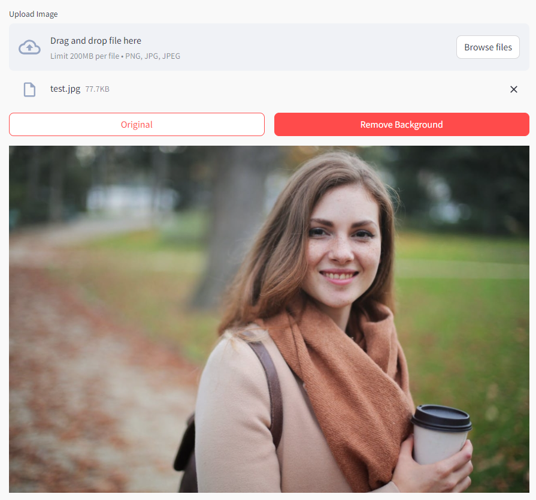
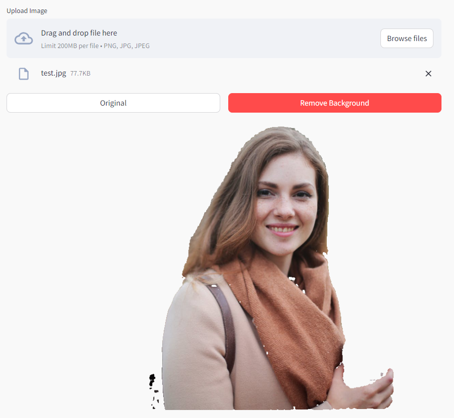

# Background remover

App to remove the background of an image. Select the original image, click on the image on the subject to be kept and then press "Remove Background" button.

<p float="left">
  
   
</p>


Source: [Machine learning web app with Python, Streamlit & Segment Anything Model](https://www.youtube.com/watch?v=W8OvdQPL7lk)

Using:
- [Segment Anything Model](https://github.com/facebookresearch/segment-anything)- produces high quality object masks from input prompts such as points or boxes
- [streamlit](https://github.com/streamlit/streamlit) - build webapps in minutes


Setup:

- download https://dl.fbaipublicfiles.com/segment_anything/sam_vit_b_01ec64.pth, which is the model file for [vit_b](https://github.com/facebookresearch/segment-anything?tab=readme-ov-file#model-checkpoints) model checkpoint

- run in terminal
```
python -m venv venv
venv\Scripts\activate
pip install -r requirements.txt
streamlit run main.py
```