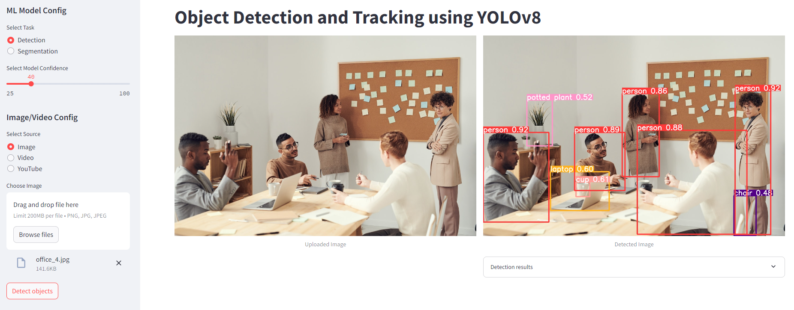
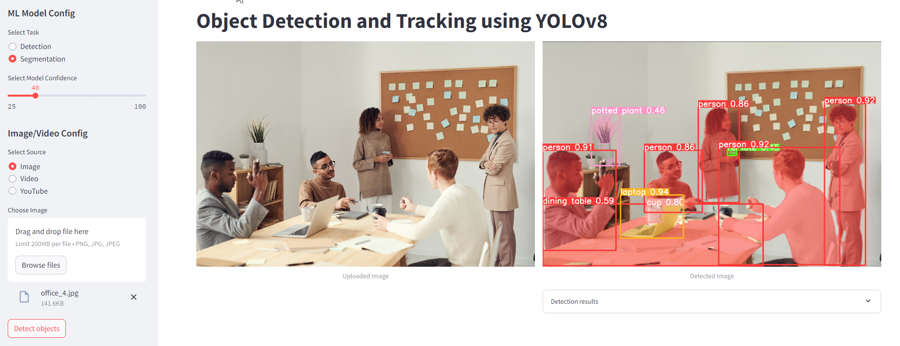
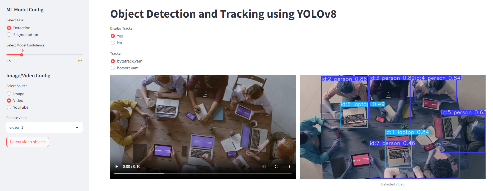
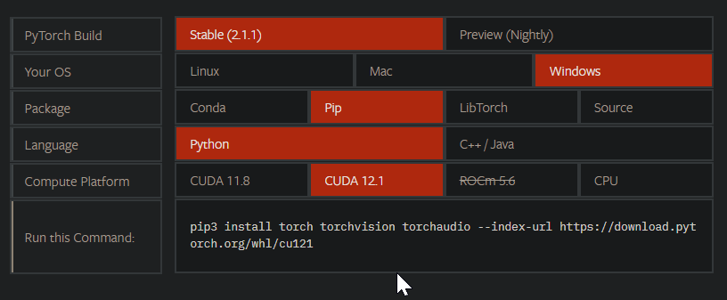
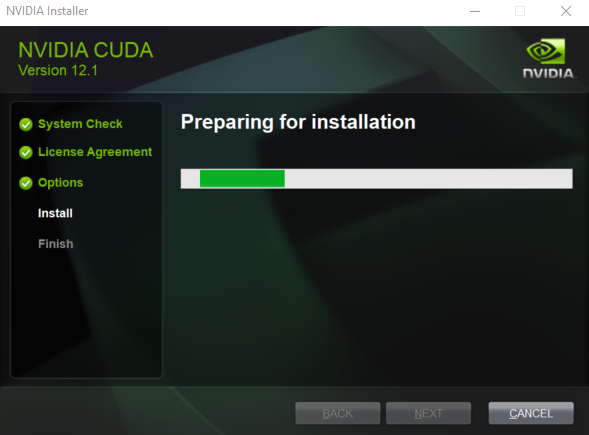

# Object detection and tracking with YOLOv8

App to detect and track objects in images and videos using YOLOv8.

__Object detection__ is the process of identifying and localizing objects in an image or video frame. __Object tracking__, on the other hand, involves estimating the state of an object, such as its position, velocity, and orientation, over time. __YOLOv8__  uses a single neural network to divide an input image or video into a grid of cells, and each cell is responsible for detecting objects in that region. The network also predicts bounding boxes, confidence scores, and class probabilities for each object detected.

## Object detection


## Object segmentation


## Object detection and tracking in video


Source: [Building a Real-Time Object Detection and Tracking App with YOLOv8 and Streamlit](https://medium.com/@mycodingmantras/building-a-real-time-object-detection-and-tracking-app-with-yolov8-and-streamlit-part-1-30c56f5eb956)

Using:
- [YOLOv8](https://github.com/ultralytics/ultralytics)
- [streamlit](https://github.com/streamlit/streamlit) - build webapps in minutes

Setup:
- go to [Pytorch website](https://pytorch.org/) and select the combo specific to your system. The command generated helped in the setup of requirements.txt.


- go to [NVidia CUDA Toolkit download page](https://developer.nvidia.com/cuda-toolkit-archive) and download the version of cuda, you selected above. Install it.


- check cuda was installed by running this command
```
nvcc --version
```

- check [yolov8n.pt](https://github.com/ultralytics/assets/releases/download/v0.0.0/yolov8n.pt) weight file, which is the smallest of the YOLOv8 models, is available in weights folder. 

- run in terminal
```
python -m venv venv
venv\Scripts\activate
pip install -r requirements.txt
streamlit run app.py
```